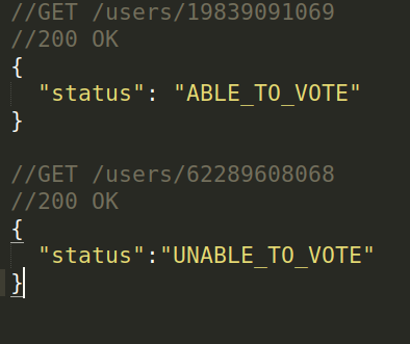
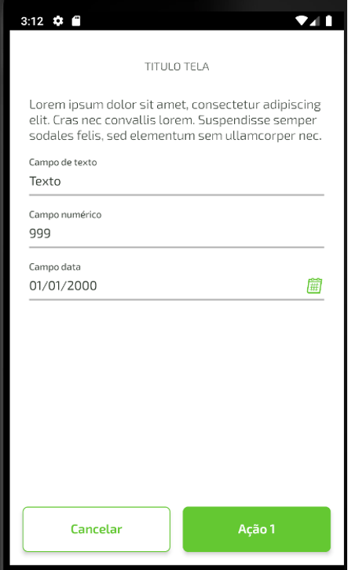
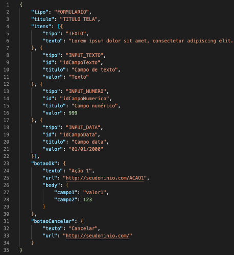
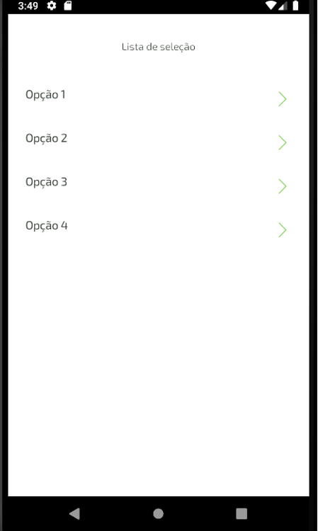
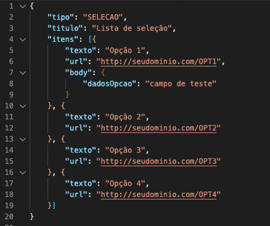

# Avaliação técnica

## Objetivo

No cooperativismo, cada associado possui um voto e as decisões são tomadas em assembleias, por votação. Imagine que você deve criar uma solução para dispositivos móveis para gerenciar e participar dessas sessões de votação.

Essa solução deve ser executada na nuvem e promover as seguintes funcionalidades através de uma API REST:

- Cadastrar uma nova pauta
- Abrir uma sessão de votação em uma pauta (a sessão de votação deve ficar aberta por um tempo determinado na chamada de abertura ou 1 minuto por default)
- Receber votos dos associados em pautas (os votos são apenas &#39;Sim&#39;/&#39;Não&#39;. Cada associado é identificado por um id único e pode votar apenas uma vez por pauta)
- Contabilizar os votos e dar o resultado da votação na pauta

Para fins de exercício, a segurança das interfaces pode ser abstraída e qualquer chamada para as interfaces pode ser considerada como autorizada. A solução deve ser construída em java, usando Spring-boot, mas os frameworks e bibliotecas são de livre escolha (desde que não infrinja direitos de uso).

É importante que as pautas e os votos sejam persistidos e que não sejam perdidos com o restart da aplicação.

O foco dessa avaliação é a comunicação entre o backend e o aplicativo mobile. Essa comunicação é feita através de mensagens no formato JSON, onde essas mensagens serão interpretadas pelo cliente para montar as telas onde o usuário vai interagir com o sistema. A aplicação cliente não faz parte da avaliação, apenas os componentes do servidor. O formato padrão dessas mensagens será detalhado no anexo 1.

## Tarefas bônus

- Tarefa Bônus 1 - Integração com sistemas externos
  - Integrar com um sistema que verifique, a partir do CPF do associado, se ele pode votar
    - GET [https://user-info.herokuapp.com/users/{cpf}](https://user-info.herokuapp.com/users/%7Bcpf%7D)
    - Caso o CPF seja inválido, a API retornará o HTTP Status 404 (Not found). Você pode usar geradores de CPF para gerar CPFs válidos
    - Caso o CPF seja válido, a API retornará se o usuário pode (ABLE\_TO\_VOTE) ou não pode (UNABLE\_TO\_VOTE) executar a operação. Essa operação retorna resultados aleatórios, portanto um mesmo CPF pode funcionar em um teste e não funcionar no outro.



Exemplos de retorno do serviço

- Tarefa Bônus 2 - Performance
  - Imagine que sua aplicação possa ser usada em cenários que existam centenas de milhares de votos. Ela deve se comportar de maneira performática nesses cenários
  - Testes de performance são uma boa maneira de garantir e observar como sua aplicação se comporta
- Tarefa Bônus 3 - Versionamento da API
  - Como você versionaria a API da sua aplicação? Que estratégia usar?

## O que será analisado

- Simplicidade no design da solução (evitar over engineering)
- Organização do código
- Arquitetura do projeto
- Boas práticas de programação (manutenibilidade, legibilidade etc)
- Possíveis bugs
- Tratamento de erros e exceções
- Explicação breve do porquê das escolhas tomadas durante o desenvolvimento da solução
- Uso de testes automatizados e ferramentas de qualidade
- Limpeza do código
- Documentação do código e da API
- Logs da aplicação
- Mensagens e organização dos commits

## Dicas

- Teste bem sua solução, evite bugs
- Deixe o domínio das URLs de callback passiveis de alteração via configuração, para facilitar o teste tanto no emulador, quanto em dispositivos fisicos.

## Observações importantes

- Não inicie o teste sem sanar todas as dúvidas
- Iremos executar a aplicação para testá-la, cuide com qualquer dependência externa e deixe claro caso haja instruções especiais para execução do mesmo

# Anexo 1

## Introdução

A seguir serão detalhados os tipos de tela que o cliente mobile suporta, assim como os tipos de campos disponíveis para a interação do usuário.

## Tipo de tela – FORMULARIO

A tela do tipo FORMULARIO exibe uma coleção de campos (itens) e possui um ou dois botões de ação na parte inferior. A seguir temos um exemplo do objeto JSON e de como a tela é exibida pelo app.

 

O aplicativo envia uma requisição POST para a url informada e com o body definido pelo objeto dentro de cada botão quando o mesmo é acionado. Nos casos onde temos campos de entrada de dados na tela, os valores informados pelo usuário são adicionados ao corpo da requisição. Abaixo o exemplo da requisição que o aplicativo vai fazer quando o botão "Ação 1" for acionado:

POST [http://seudominio.com/ACAO1](http://seudominio.com/ACAO1)

```json
{

    "campo1": "valor1",
    "campo2": 123,
    "idCampoTexto": "Texto",
    "idCampoNumerico": 999,
    "idCampoData": "01/01/2000"

}
```

Obs: o formato da url acima é meramente ilustrativo e não define qualquer padrão de formato.

## Tipo de tela – SELECAO

A tela do tipo SELECAO exibe uma lista de opções para que o usuário.

 

O aplicativo envia uma requisição POST para a url informada e com o body definido pelo objeto dentro de cada item da lista de seleção, quando o mesmo é acionado, semelhando ao funcionamento dos botões da tela FORMULARIO.
